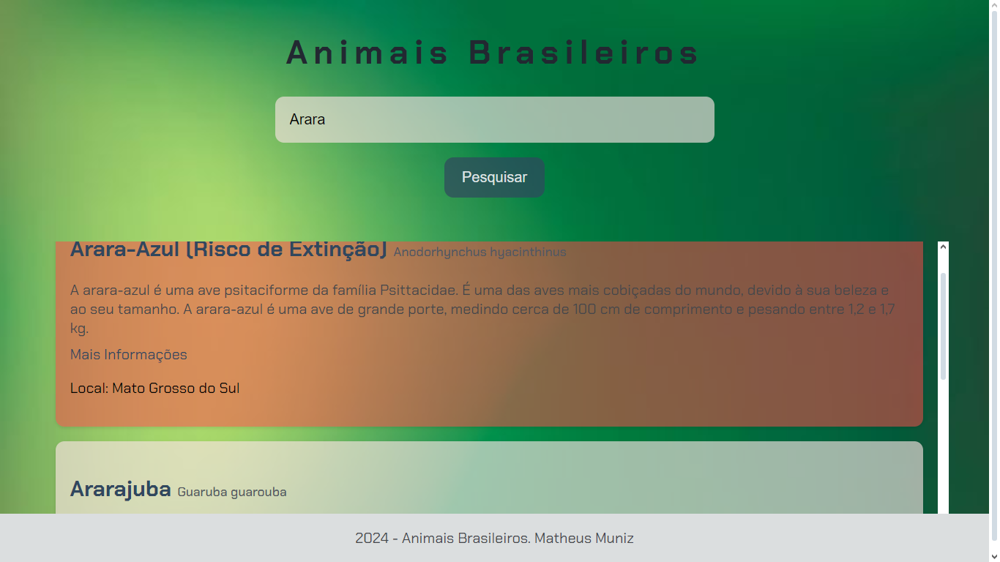

# Animais Brasileiros

Este projeto é um site que exibe informações sobre animais brasileiros. Ele permite aos usuários pesquisar e visualizar informações detalhadas sobre diversos animais nativos do Brasil.

## Descrição

O site é desenvolvido em HTML, CSS e JavaScript e inclui as seguintes funcionalidades:

- **Barra de Pesquisa:** Permite aos usuários digitar o nome de um animal e buscar informações sobre ele.
- **Exibição de Resultados:** Mostra informações detalhadas sobre o animal pesquisado, incluindo nome, espécie, descrição, local onde é encontrado e links para mais informações.

## Tecnologias Utilizadas

- **HTML:** Estrutura básica do site.
- **CSS:** Estilização e design responsivo para uma melhor experiência do usuário.
- **JavaScript:** Funcionalidade para pesquisa e exibição de informações dos animais.

## Funcionalidades

- **Pesquisa de Animais:** A barra de pesquisa permite procurar por animais específicos.
- **Informações Detalhadas:** Exibe detalhes sobre cada animal, como nome, espécie, descrição, local e tags relacionadas.
- **Responsividade:** O design é otimizado para diferentes tamanhos de tela, garantindo uma boa experiência em dispositivos móveis e desktops.

## Como Usar

1. **Digite o Nome do Animal:** No campo de pesquisa, insira o nome do animal que deseja pesquisar.
2. **Clique em "Pesquisar":** Após inserir o nome, clique no botão de pesquisa para exibir os resultados.
3. **Visualize as Informações:** As informações sobre o animal pesquisado serão exibidas abaixo da barra de pesquisa.

## Animais

- Arara-Azul
- Onça-Pintada
- Tucano
- Mico-Leão-Dourado
- Preguiça
- Lobo-Guará
- Tamanduá-Bandeira
- Peixe-Boi
- Ararajuba
- Jararaca
- Boto-Cor-de-Rosa
- Cágado-de-Hogei
- Pica-pau-do-parnaíba
- Cervo-do-pantanal
- Capivara
- Sabiá-Laranjeira
- Macaco-Prego
- Tamanduá-Mirim
- Jabuti-Piranga
- Caititu
- Gavião-Real
- Quati
- Ariranha
- Perereca-de-Folhagem

## Deploy
https://animais-brasileiros.vercel.app
